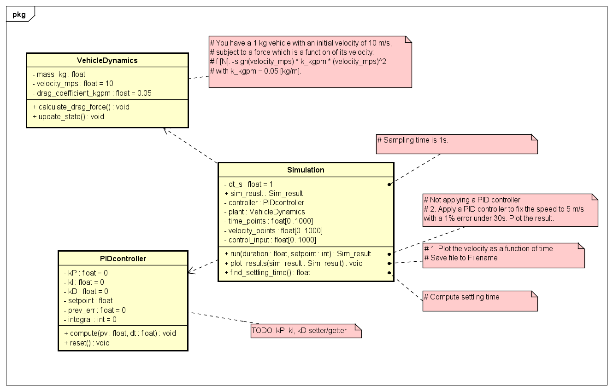
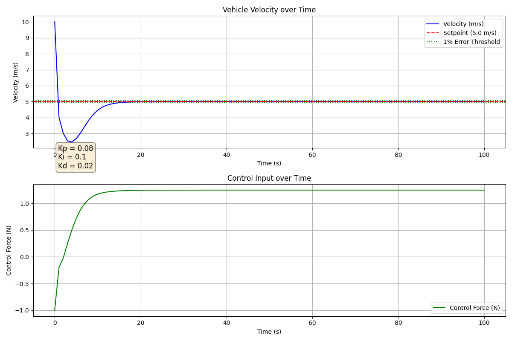

# assignment-pid-simulator

----------------------------------------------------------------------------------------------------------------------------------------
I would like you to write a python script(s) to solve a problem.

Please define classes or functions as needed, and write at least a unit test (pytest) per object.

I am not looking for a complex implementation (actually a simple implementation is ok), but I want to see a good understanding of encapsulation (organization of classes and functions) and a few examples of how you would test in pytest.

Consider sharing the output by github.

----------------------------------------------------------------

Consider the following one dimensional problem:

You have a 1 kg vehicle with an initial velocity of 10 m/s,
subject to a force which is a function of its velocity:

- f [N]: -sign(velocity_mps) * k_kgpm * (velocity_mps)^2 

- with k_kgpm = 0.05 [kg/m].

- Sampling time is 1s.

--- 

### 0. Simulation implementation & unit test
See Class Diagram_Vehicle Dynamic with PID control.png for class design

All unit test int ./tests/ are passed with pytest
--- 
### 1. Plot the velocity as a function of time

See unontrolled_v_t_plot.png

--- 

### 2. Apply a PID controller to fix the speed to 5 m/s with a 1% error under 30s. Plot the result.

See pid_controlled_v_t_plot.png

--- 

### 3. Explain how you selected the gains. Are these robust with respect changes in the initial velocity
--> The vehicle dynamics is inherently non-linear(quadratic to velocity), consider Method 1 & 2

#### Method 1: Manual PID tuning
EOM(dv/dt = u + f = u - sign(v)*k*v^2) shows the characteristic of system to be:
- Negative sign for quadratic term indicate the system is likely to converge
- insensitive to control input at high velocity
- sensitive to control input at low velocity

From this nature, we can decide manual PID tuning strategy
- Gains tuned at large initial velocity should still make low initial velocity case stable
- Start wtih PI term since the system was not subjected to high frequency disturbance
- Start with high Kp for better response time
- Adjust Ki to reduce steady-state error
- Add some Kd but be aware not to make sharp actions

Based on the judgement above, the selected gain should be robust for lower initial velocity, margin for higher initial velocity should be investigated.

#### Method 2: Gain Scheduling
To improve the control performance throughout all velocity region, we can apply a simple gain schedule
- For v > 1 (m/s), larger Kp, Ki preffered
- For v <> 1 (m/s), smaller Kp, Ki preffered

